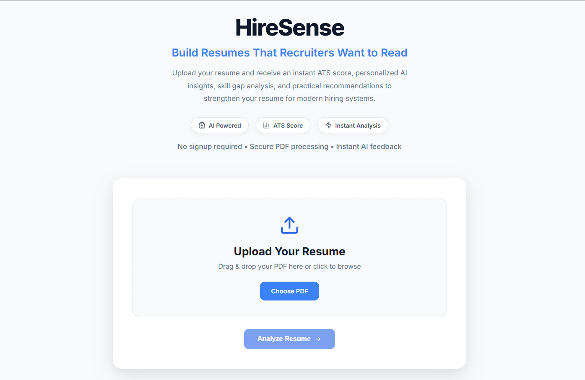
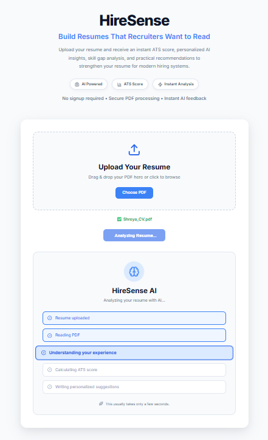
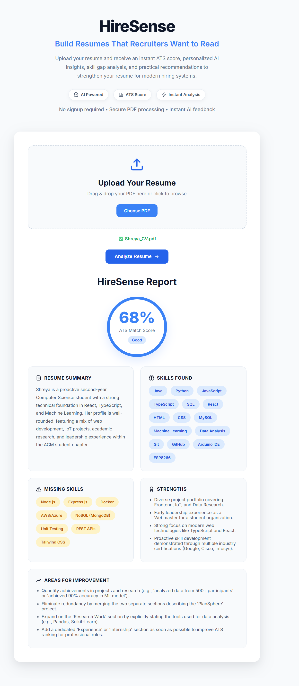

# HireSense

An AI-powered Resume Analyzer that evaluates resumes, generates ATS compatibility scores, identifies missing skills, and provides personalized improvement suggestions using Google Gemini AI.

---

## 🌐 Live Demo

**🚀 Try HireSense:** https://hire-sense-kappa.vercel.app

> **Note:** The backend is hosted on Render's free tier. The first request after inactivity may take up to 60 seconds while the server wakes up.

## 📖 Overview

Hiring processes today rely heavily on Applicant Tracking Systems (ATS), making it difficult for candidates to understand how well their resumes align with industry expectations.

HireSense simplifies this process by allowing users to upload their resume in PDF format and receive an AI-generated analysis within seconds. The application extracts resume content, evaluates ATS compatibility, summarizes the profile, identifies strengths and missing skills, and provides actionable recommendations to improve the resume.

Designed with a modern full-stack architecture, HireSense demonstrates the integration of AI, backend APIs, PDF processing, and responsive frontend development into a single production-ready application.

## 🛠️ Tech Stack

| Layer | Technology |
|--------|------------|
| Frontend | React, Vite, CSS3 |
| Backend | Node.js, Express.js |
| AI | Google Gemini API |
| File Processing | Multer, pdf-parse |
| Language | JavaScript |
| Version Control | Git & GitHub |

## 📂 Project Structure

```text
HireSense/
├── backend/
│   ├── routes/              # API endpoints
│   ├── uploads/             # Temporary PDF uploads
│   ├── server.js            # Express server
│   ├── package.json
│   └── ...
│
├── frontend/
│   ├── public/
│   ├── src/
│   │   ├── assets/          # Images and static assets
│   │   ├── components/      # Reusable UI components
│   │   ├── App.jsx
│   │   └── main.jsx
│   ├── package.json
│   └── ...
│
├── Screenshots/
│   ├── Landing.png
│   ├── Loading.png
│   └── Results.png
│
└── README.md
```

## 🚀 Getting Started

### Prerequisites

- Node.js v18 or later
- Google Gemini API Key
- npm

- ### Environment Variables

Create a `.env` file inside the `backend` directory and add:

```env
GEMINI_API_KEY=your_api_key_here
PORT=5000
```

### Installation

Clone the repository:

```bash
git clone https://github.com/your-username/HireSense.git
cd HireSense
```

Install backend dependencies:

```bash
cd backend
npm install
```

Install frontend dependencies:

```bash
cd ../frontend
npm install
```

### Running the Project

Start the backend server:

```bash
cd backend
npm run dev
```

The backend will run at:

```
http://localhost:5000
```

Start the frontend (in a separate terminal):

```bash
cd frontend
npm run dev
```

The frontend will run at:

```
http://localhost:5173
```

## 📸 Screenshots

## 📸 Screenshots

### Landing Page



---

### AI Analysis



---

### Results Dashboard




## 🚀 Future Enhancements

- Job Description (JD) matching
- User authentication and profile management
- Resume analysis history
- Downloadable PDF reports
- Resume version comparison
- Multi-language resume support
- AI-powered interview preparation

- ## 👩‍💻 Author

**Shreya Dwivedi**

- GitHub: https://github.com/Shreya-2cu
- LinkedIn: https://www.linkedin.com/in/shreya-dwivedi-b0147b408/

- ## 📄 License

This project is licensed under the MIT License.
